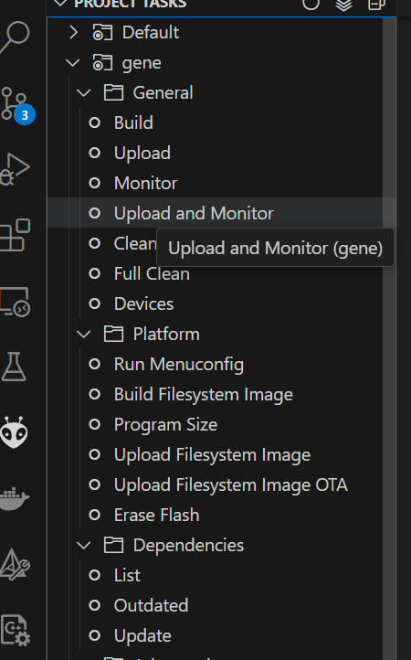
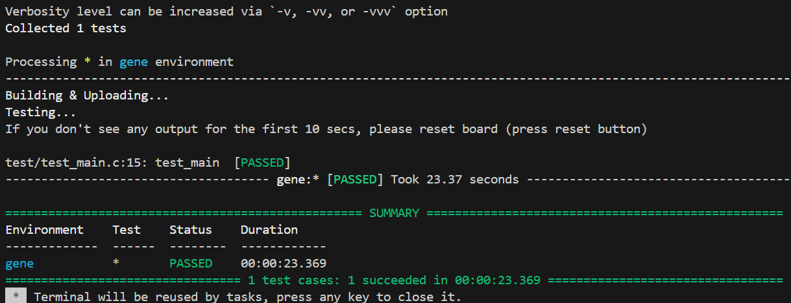
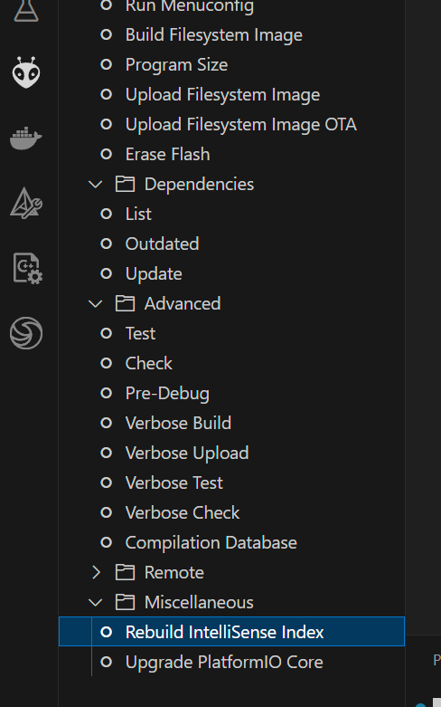

# gene platformio sample project

## About gene

* ESP32-S3-WROOM-1-N16R8を搭載 (Dual core, WiFi/Bluetooth classic/BLE, ...)
* 16 pinout (3V3, GND, SPI, i2c, GPIO, ...)
* 400mA/h
* USB TYPE-C
* MicroSD slot x1
* RGB LED x1, Charge LED
* Power btn, Reset btn

## About Project

このプロジェクトは Visual Studio Code 上での extension [platformio](https://platformio.org/)を使用しております。
プロジェクト構成は platformio の project structure に則っており以下のようになっています。

```
/
 .vscode/
         extensions.json
         settings.json
 boards/
        gene.json # board 定義
 main/            # src -> main に変更
        main.c
 CMakeLists.txt   # espressif idf ビルドファイル
 platformio.ini   # platformio プロジェクトの定義
 README.md
```

上記のように必要な定義ファイルが含まれているので、Visual Studio Code で開けば、自動にextension のインストールが行われすぐに開発ができるようになっています。

## How to build

Visual Studio Code で platformio extension のインストールを済ませばビルドなどが通る状態になっているので、
platformio extension 画面から "build" を実行するだけで firmware が作成される。


その後 gene をUSB接続し、"Upload and Monitor" を実行すれば firmware の書き込みが完了する。



TERMINAL 画面で以下の出力が確認できます。

```
--- Terminal on COM6 | 115200 8-N-1
--- Available filters and text transformations: colorize, debug, default, direct, esp32_exception_decoder, hexlify, log2file, nocontrol, printable, send_on_enter, time
--- More details at https://bit.ly/pio-monitor-filters
--- Quit: Ctrl+C | Menu: Ctrl+T | Help: Ctrl+T followed by Ctrl+H
␛[0;32mI (4312) app: Hello World.␛[0m
␛[0;32mI (5312) app: Hello World.␛[0m
␛[0;32mI (6312) app: Hello World.␛[0m
␛[0;32mI (7312) app: Hello World.␛[0m
␛[0;32mI (8312) app: Hello World.␛[0m
␛[0;32mI (9312) app: Hello World.␛[0m
```

## How to Test

テストには2種あります。

* "test" 内のコードを実機で実行する unit test
* host pc の pytest で実行される、端末のログ出力で動作確認を行う output test


### Unit test
platformio extension の Advanced/Test を実行すると以下の結果が得られる。



### Pytest

vscode ではなく [idf sdk] (https://docs.espressif.com/projects/esp-idf/en/v5.2.3/esp32s3/contribute/esp-idf-tests-with-pytest.html) で実行されます。
windows では sdk install した後、"ESP-IDF 5.x" terminal 内で "pytest" を用いてテストできます。

[インストール方法](https://docs.espressif.com/projects/esp-idf/en/v5.2.3/esp32s3/contribute/esp-idf-tests-with-pytest.html#installation) に従いツールを整備してください。

プロジェクトルートで事前に以下を行っておく。
```
$ idf.py set-target esp32s3
$ idf.py build
```

pytest の実行

```
$ pytest
...
--------------------------------------------------- live log setup ----------------------------------------------------
2024-10-03 19:10:38 INFO Target: esp32s3, Port: COM18
2024-10-03 19:10:38 Connecting....
2024-10-03 19:10:39 esptool.py v4.7.0
2024-10-03 19:10:39 Found 5 serial ports
2024-10-03 19:10:39 Chip is ESP32-S3 (QFN56) (revision v0.1)
2024-10-03 19:10:39 Features: WiFi, BLE, Embedded PSRAM 8MB (AP_3v3)
2024-10-03 19:10:39 Crystal is 40MHz
2024-10-03 19:10:39 MAC: 68:b6:b3:22:5b:1c
2024-10-03 19:10:39 Uploading stub...
2024-10-03 19:10:40 Running stub...
2024-10-03 19:10:40 Stub running...
2024-10-03 19:10:40 Changing baud rate to 921600
2024-10-03 19:10:40 Changed.
2024-10-03 19:10:41 Configuring flash size...
2024-10-03 19:10:42 Flash will be erased from 0x00000000 to 0x00005fff...
2024-10-03 19:10:42 Flash will be erased from 0x00008000 to 0x00008fff...
2024-10-03 19:10:42 Flash will be erased from 0x00010000 to 0x00045fff...
2024-10-03 19:10:42 Compressed 21072 bytes to 13075...
Wrote 21072 bytes (13075 compressed) at 0x00000000 in 0.5 seconds (effective 345.4 kbit/s)...
2024-10-03 19:10:43 Hash of data verified.
2024-10-03 19:10:43 Compressed 3072 bytes to 103...
Wrote 3072 bytes (103 compressed) at 0x00008000 in 0.1 seconds (effective 270.9 kbit/s)...
2024-10-03 19:10:43 Hash of data verified.
2024-10-03 19:10:43 Compressed 219072 bytes to 110734...
Wrote 219072 bytes (110734 compressed) at 0x00010000 in 2.7 seconds (effective 653.9 kbit/s)...
2024-10-03 19:10:46 Hash of data verified.
2024-10-03 19:10:46
2024-10-03 19:10:46 Leaving...
2024-10-03 19:10:46 Hard resetting via RTS pin...
2024-10-03 19:10:47 OM:esp32s3-20210327
2024-10-03 19:10:47 Build:Mar 27 2021
2024-10-03 19:10:47 rst:0x1 (POWERON),boot:0x8 (SPI_FAST_FLASH_BOOT)
2024-10-03 19:10:47 SPIWP:0xee
2024-10-03 19:10:47 mode:DIO, clock div:1
2024-10-03 19:10:47 load:0x3fce3810,len:0x178c
2024-10-03 19:10:47 load:0x403c9700,len:0x4
2024-10-03 19:10:47 load:0x403c9704,len:0xcbc
2024-10-03 19:10:47 load:0x403cc700,len:0x2da0
2024-10-03 19:10:47 entry 0x403c9914
2024-10-03 19:10:47 I (27) boot: ESP-IDF v5.2.1 2nd stage bootloader
2024-10-03 19:10:47 I (27) boot: compile time Oct  3 2024 13:30:25
2024-10-03 19:10:47 I (27) boot: Multicore bootloader
2024-10-03 19:10:47 I (30) boot: chip revision: v0.1
2024-10-03 19:10:47 I (34) boot.esp32s3: Boot SPI Speed : 80MHz
2024-10-03 19:10:47 I (38) boot.esp32s3: SPI Mode       : DIO
2024-10-03 19:10:47 I (43) boot.esp32s3: SPI Flash Size : 2MB
2024-10-03 19:10:47 I (48) boot: Enabling RNG early entropy source...
2024-10-03 19:10:47 I (53) boot: Partition Table:
2024-10-03 19:10:47 I (57) boot: ## Label            Usage          Type ST Offset   Length
2024-10-03 19:10:47 I (64) boot:  0 nvs              WiFi data        01 02 00009000 00006000
2024-10-03 19:10:47 I (72) boot:  1 phy_init         RF data          01 01 0000f000 00001000
2024-10-03 19:10:47 I (79) boot:  2 factory          factory app      00 00 00010000 00100000
2024-10-03 19:10:47 I (87) boot: End of partition table
2024-10-03 19:10:47 I (91) esp_image: segment 0: paddr=00010020 vaddr=3c020020 size=0cd14h ( 52500) map
2024-10-03 19:10:47 I (109) esp_image: segment 1: paddr=0001cd3c vaddr=3fc91d00 size=028c0h ( 10432) load
2024-10-03 19:10:47 I (111) esp_image: segment 2: paddr=0001f604 vaddr=40374000 size=00a14h (  2580) load
2024-10-03 19:10:47 I (117) esp_image: segment 3: paddr=00020020 vaddr=42000020 size=184ach ( 99500) map
2024-10-03 19:10:47 I (142) esp_image: segment 4: paddr=000384d4 vaddr=40374a14 size=0d2bch ( 53948) load
2024-10-03 19:10:47 I (160) boot: Loaded app from partition at offset 0x10000
2024-10-03 19:10:47 I (160) boot: Disabling RNG early entropy source...
2024-10-03 19:10:47 I (172) cpu_start: Multicore app
2024-10-03 19:10:47 I (181) cpu_start: Pro cpu start user code
2024-10-03 19:10:47 I (181) cpu_start: cpu freq: 160000000 Hz
2024-10-03 19:10:47 I (181) cpu_start: Application information:
2024-10-03 19:10:47 I (184) cpu_start: Project name:     gene_platformio_helloworld
2024-10-03 19:10:47 I (191) cpu_start: App version:      v0.1-7-g551806b
2024-10-03 19:10:47 I (197) cpu_start: Compile time:     Oct  3 2024 13:30:05
2024-10-03 19:10:47 I (203) cpu_start: ELF file SHA256:  a7a187cea...
2024-10-03 19:10:47 I (208) cpu_start: ESP-IDF:          v5.2.1
2024-10-03 19:10:47 I (213) cpu_start: Min chip rev:     v0.0
2024-10-03 19:10:47 I (218) cpu_start: Max chip rev:     v0.99
2024-10-03 19:10:47 I (222) cpu_start: Chip rev:         v0.1
2024-10-03 19:10:47 I (227) heap_init: Initializing. RAM available for dynamic allocation:
2024-10-03 19:10:47 I (234) heap_init: At 3FC94E90 len 00054880 (338 KiB): RAM
2024-10-03 19:10:47 I (241) heap_init: At 3FCE9710 len 00005724 (21 KiB): RAM
2024-10-03 19:10:47 I (247) heap_init: At 3FCF0000 len 00008000 (32 KiB): DRAM
2024-10-03 19:10:47 I (253) heap_init: At 600FE010 len 00001FD8 (7 KiB): RTCRAM
2024-10-03 19:10:47 I (260) spi_flash: detected chip: gd
2024-10-03 19:10:47 I (263) spi_flash: flash io: dio
2024-10-03 19:10:47 W (267) spi_flash: Detected size(16384k) larger than the size in the binary image header(2048k). Using the size in the binary image header.
2024-10-03 19:10:47 I (281) sleep: Configure to isolate all GPIO pins in sleep state
2024-10-03 19:10:47 I (287) sleep: Enable automatic switching of GPIO sleep configuration
2024-10-03 19:10:47 I (295) main_task: Started on CPU0
2024-10-03 19:10:47 I (305) main_task: Calling app_main()
2024-10-03 19:10:47 I (305) sample: Hello World.
PASSED

================================================== 1 passed in 9.84s ==================================================
```


## Troubleshooting

#### include path が通らず Build できない場合

すでに platformio を使用している場合などにこの問題が起こった場合以下を実行すると解決されるかもしれません

##### PlatformIO の更新


##### Intelisense index の更新


