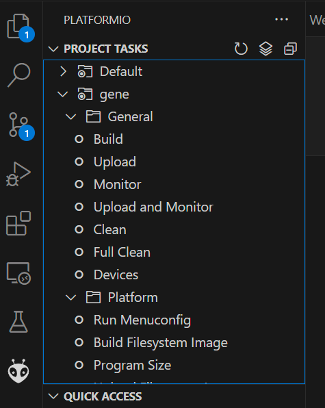
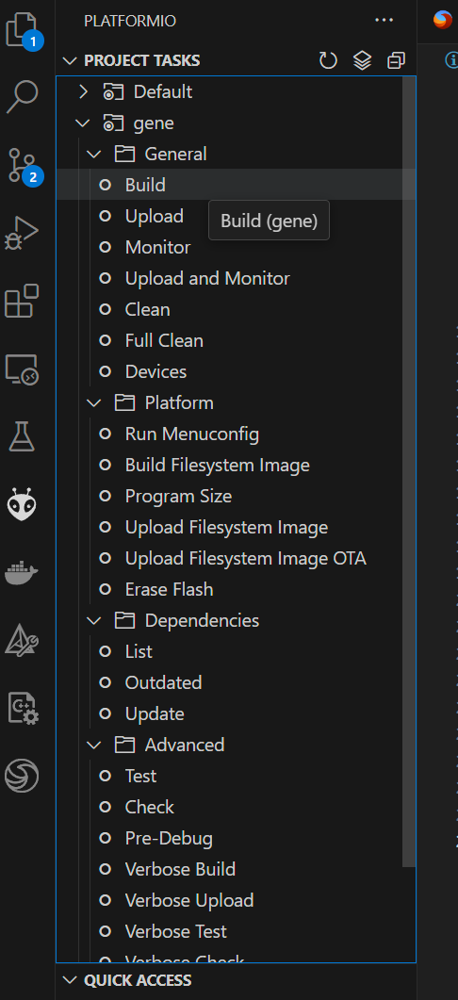
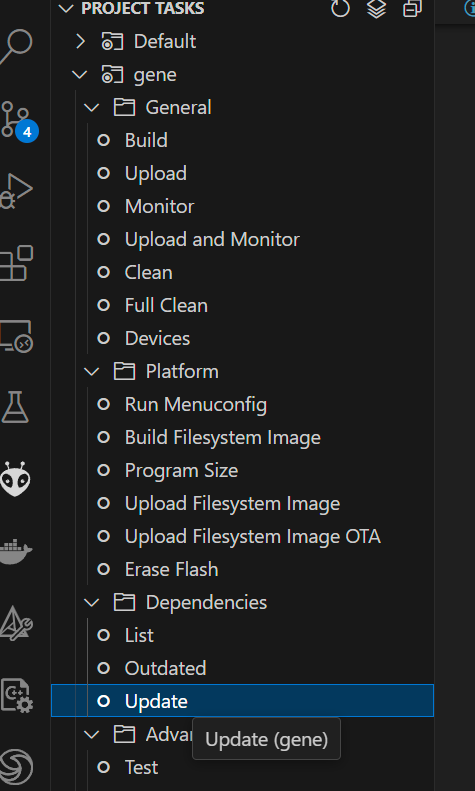

# gene platformio sample project

## About Project

このプロジェクトは Visual Studio Code 上での extension [platformio](https://platformio.org/)を使用しております。
プロジェクト構成は platformio の project structure に則っており以下のようになっています。

```
/
 .vscode/
         extensions.json
         settings.json
 boards/
        gene.json # board 定義
 src/
        main.c
 CMakeLists.txt   # espressif idf ビルドファイル
 platformio.ini   # platformio プロジェクトの定義
 README.md
```

上記のように必要な定義ファイルが含まれているので、Visual Studio Code で開き extension のインストールを行うことで
すぐに開発ができるようになっています。



## How to build

Visual Studio Code で platformio extension のインストールを済ませばビルドなどが通る状態になっているので、
platformio extension 画面から "build" を実行するだけで firmware が作成される。



その後 gene をUSB接続し、"Upload and Monitor" を実行すれば firmware の書き込みが完了する。


TERMINAL 画面で以下の出力が確認できます。

```
--- Terminal on COM6 | 115200 8-N-1
--- Available filters and text transformations: colorize, debug, default, direct, esp32_exception_decoder, hexlify, log2file, nocontrol, printable, send_on_enter, time
--- More details at https://bit.ly/pio-monitor-filters
--- Quit: Ctrl+C | Menu: Ctrl+T | Help: Ctrl+T followed by Ctrl+H
␛[0;32mI (4312) app: Hello World.␛[0m
␛[0;32mI (5312) app: Hello World.␛[0m
␛[0;32mI (6312) app: Hello World.␛[0m
␛[0;32mI (7312) app: Hello World.␛[0m
␛[0;32mI (8312) app: Hello World.␛[0m
␛[0;32mI (9312) app: Hello World.␛[0m
```

## Troubleshooting

* include path が通らず Build できない場合

すでに platformio を使用している場合などにこの問題が起こった場合以下を実行すると解決されるかもしれません

PlatformIO の更新


Intelisense index の更新
